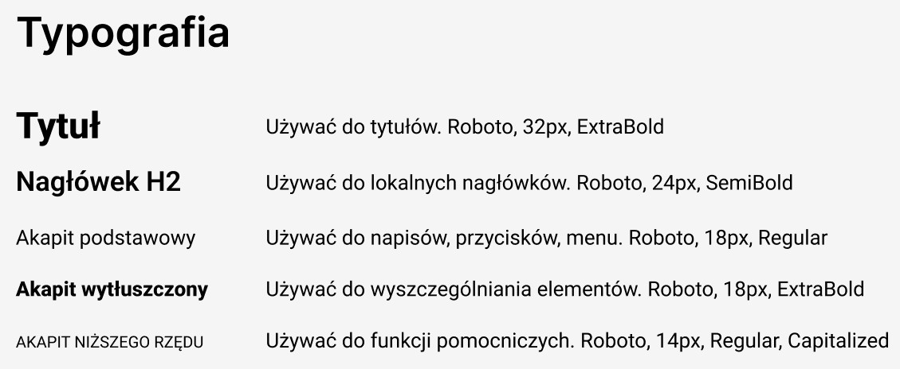
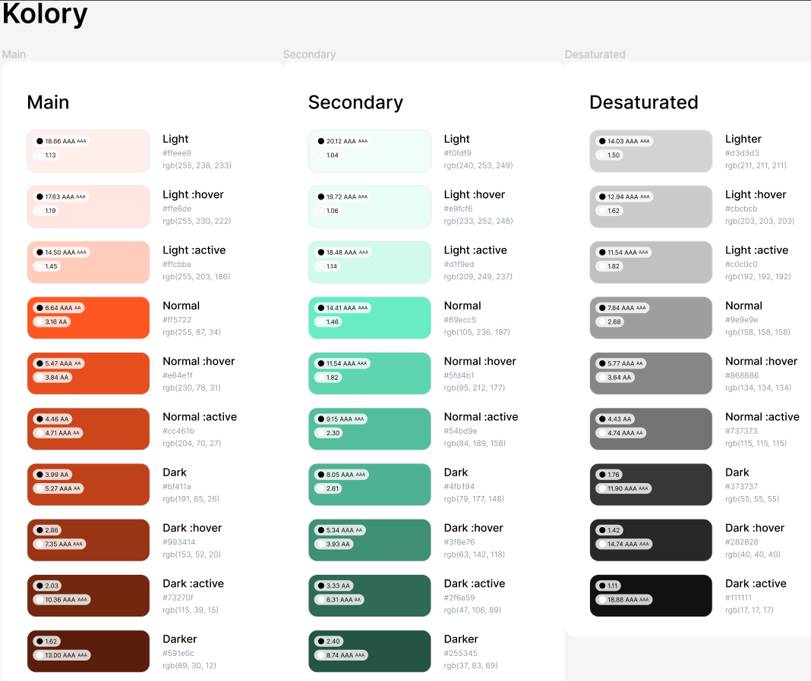

# Raport zbiorczy

## Identyfikacaj procesów biznesowych w projekcie 

*autorzy: Angelina Sudenkova, Jakub Wysocki*  
*konsultacje i akcpetacja: Tymoteusz Gryszkalis*

###  Identyfikacaj procesów biznesowych

- **Synchronizacja danych między stroną internetową a aplikacją mobilną:**
[Użytkownik dokonuje zmiany danych] Użytkownik zmienia dane, takie jak profil użytkownika, preferencje, ustawienia, zawartość, itp., zarówno na stronie internetowej, jak i w aplikacji mobilnej.[System wykrywa zmiany] System stale monitoruje aktywność użytkownika na obu platformach i wykrywa wszelkie zmiany w danych.[Inicjacja procesu synchronizacji] Po wykryciu zmian w danych na jednej z platform, system inicjuje proces synchronizacji, mający na celu zrównanie danych między stroną internetową a aplikacją mobilną.[Analiza różnic w danych] System analizuje różnice w danych między platformami, identyfikując, które dane wymagają synchronizacji.[Synchronizacja danych] Dane, które uległy zmianie na jednej z platform, są synchronizowane z odpowiednią platformą docelową.Proces synchronizacji obejmuje przesyłanie, aktualizację i zapisywanie danych na obu platformach w celu zapewnienia ich zgodności.

- **Aktualizacja produktów usługodawcy przez system** :
System codziennie sprawdza czy po stronie usługodawcy pojawiły się zmiany wśród produktów do sprzedaży, jeśl nie przechodzi do kolejengo usługodawcy tak długo aż sprawdzi wszystkich, jeśli tak to dokonuje aktualizacji produktów danego usługodawcy w systemie w przypadku dodanie nowego produktu zostaje wysłane powiadomienie od użytkowników którzy mają zasubskrybowany profil usługodawcy lub mają dokonaną niedawny zakup od tego usługodawcy oraz nie mają zablokowanych,

- **Dodawanie postów przez usługodawców**
Usługodawca przechodzi do opcji dodawania nowego posta na swoim profilu.[Tworzenie treści posta]Usługodawca wprowadza treść posta, która może zawierać tekst, multimedia (zdjęcia, widea).[Personalizacja posta] Może również dodawać hasztagi lub oznaczenia, aby treść była łatwiej odnajdywana przez użytkowników.[Dodawanie dodatkowych informacji] Jeśli to konieczne, usługodawca może dodać dodatkowe informacje, takie jak  ceny, szczegóły, itp., w zależności od charakteru posta.[Podgląd i edycja] Przed opublikowaniem, usługodawca może obejrzeć podgląd posta, aby upewnić się, że wygląda on zgodnie z jego oczekiwaniami.W przypadku konieczności, może dokonać edycji treści lub układu posta.[Publikacja posta] Po zakończeniu tworzenia i personalizacji, usługodawca potwierdza publikację posta. Post staje się dostępny dla użytkowników do przeglądania.

- **Dodanie promocji przez usługodawca** :
Usługodawca po analizie sprzedaży sprzedaży decyduje się wystawić promocje przegląda listę swoich produktów wybiera odpowiednie produkty po wybraniu ustawia czas trwania promocji oraz procent zniżki po wybraniu wybiera opcję dodania promocji i system aktualizuje cenę,  zostaje wysłane powiadomienie o promocji  od użytkowników którzy mają zasubskrybowany profil usługodawcy lub mają dokonaną niedawny zakup od tego usługodawcy oraz nie mają zablokowanych powiadomień o promocjach.

- **Dostawa produktów** : 
Powiadomienie firmy kurierskie o specyfikacji zamówienia i usługodawców poszczególnych części zamówienia. Kiedy minie odpowiedni czas kurier zaczyna realizować zamówienie zaczyna od zmiany statusu zamówienia w systemie, następnie kompletuje poszczególne części zamówienia od różnych dostawców/usługodawców jeśli jakiś z usługodawców nie będzie miał możliwości wydania zamówienie kurie zaznacza to w systemie a system wysyła powiadomienie do użytkownika który złożył to zamówienie o braku możliwości złożenia całego zamówienia i udziel mu stosownie kredyty na produkty usługodawcy który zawinił. Jeśli zamówienie zostanie skompletowane przez kuriera (pomijając produkty których nie mógł wystąpić usługodawca) Kurier aktualizuje status zamówienia i dostarcza zamówienie po czym klient odbiera zamówienie a kurie aktualizuje status dostawy. Do użytkownika, jeśli zamówienie nie mogło być dostarczone z powodu kuriera przyznawana jest stosowna rekompensata dla użytkownika na dowolne produkty.  

- **Wystawianie recenzji przez użytkowników**
Użytkownik poszukuję usługodawcę dla którego chce pozostawić recenzję.[Wybór produktu] Użytkownik wybiera konkretny produkt lub danie dla którego chce wystawić recenzję. [Wpisane recenzji] Użytkownik wprowadza tekst recenzji, w którym dzieli się swoją opinią na temat dania, diety lub usługodawcy. [Ocena w skali 5 gwiazdek] Użytkownik przypisuje ocenę produktu/usługodawcy w skali od 1 do 5 gwiazdek. [Potwierdzenie dodania recenzji] Po zakończeniu pisania recenzji i przypisania oceny, użytkownik  sprawdza poprwaność swojej recenzji. Jeżeli dane są poprawne użytkownik potwierdza dodanie recenzji. 

- **Przyznawanie kredytów jako rekompensata**
[Zgłoszenie problemu przez użytkownika] Użytkownik informuje usługodawcę o problemie poprzez odpowiednią sekcję w systemie lub poprzez wystawienie recenzji. [Analiza problemu przez obsługę klienta] Zespół obsługi klienta analizuje zgłoszenie użytkownika, aby zrozumieć naturę problemu oraz określić, czy problem był po stronie usługodawcy czy też związany z dostawą.[Określenie przyczyny problemu] W przypadku, gdy problem wynikał z opóźnienia w dostawie lub uszkodzenia produktu, a było to związane z działaniem usługodawcy, przyznawane są kredyty jako rekompensata. Jeśli problem nie wynikał z winy usługodawcy (np. problem z kurierem), analizuje się sytuację, aby ustalić, czy kredyty będą przyznane jako rekompensata. [Pzyznanie kredytów] Jeśli problem był po stronie usługodawcy, kredyty są automatycznie przyznawane użytkownikowi jako rekompensata. Kredyty są dodawane do konta użytkownika i są dostępne do wykorzystania podczas kolejnych zakupów. [Warunki wykorzystania kredytów] Jeśli problem był po stronie usługodawcy, kredyty mogą być wykorzystane wyłącznie do zakupu produktów tego usługodawcy. Jeśli problem nie był po stronie usługodawcy, kredyty mogą być użyte do zakupu dowolnych produktów na platformie.[Powiadomienie użytkownika o przyznaniu kredytów] Użytkownik otrzymuje powiadomienie o przyznaniu kredytów jako rekompensaty za problem związany z dostawą lub produktem. Informacja ta zawiera również instrukcje dotyczące warunków wykorzystania kredytów.

- **Wykorzystanie kredytów podczas dokonywania zamówienia**
[Wybór płatności] Po zakończeniu wyboru produktów, użytkownik przechodzi do procesu płatności. W trakcie tego kroku ma możliwość wyboru sposobu płatności, w tym także opcji wykorzystania posiadanych kredytów.[Użycie kredytów] Jeśli użytkownik posiada wystarczającą liczbę kredytów na koncie, może zdecydować się na ich wykorzystanie jako formy płatności za zamówienie. System automatycznie oblicza wartość kredytów, które można zastosować do zredukowania całkowitej kwoty do zapłaty.[Potwierdzenie płatności] Po wyborze opcji wykorzystania kredytów, użytkownik potwierdza swoją decyzję i dokonuje finalizacji zamówienia.Jeżeli ilość kredytów nie jest wystarczająca do całkowitej zapłaty za zamówienie, użtkownik musi wybrać inną metodę płatności dla pozostałej kwoty. System uwzględnia użyte kredyty podczas obliczania kwoty do zapłaty.[Zakończenie transakcji] Po pomyślnym potwierdzeniu płatności, zamówienie jest składane, a użytkownik otrzymuje potwierdzenie transakcji. Produkty zostają przygotowane do dostawy lub odbioru zgodnie z wybranymi preferencjami dostawy.

- **Dokonanie płatności**
[PB Zakup produktów przez klienta]. [Przejście do płatności] Po zakończeniu wyboru produktów, użytkownik przechodzi do procesu płatności. W tym momencie może wybrać preferowany sposób płatności spośród dostępnych opcji: blikiem, kartą lub kredytem. Użytkownik decyduje czy dokonuje płatności kredytem. W przypdku braku wystarczającej ilości kredytu lub odrzucenia tej opcji następuje [wybór opcji płatności] Użytkownik wybiera jedną z dostępnych opcji płatności:

    Blik: Jeśli użytkownik wybiera płatność za pomocą blika, wprowadza odpowiedni kod autoryzacyjny wygenerowany przez aplikację bankową na swoim smartfonie.
    Karta: W przypadku płatności kartą, użytkownik wprowadza dane karty płatniczej, takie jak numer karty, datę ważności i kod CVV.
    Kredyt: [PB Wykorzystanie kredytów podczas dokonywania zamówienia]

    [Potwierdzenie płatności] Po wyborze odpowiedniej opcji płatności, użytkownik potwierdza swoją decyzję. W przypadku płatności blikiem lub kartą, może być dodatkowo wymagane potwierdzenie autoryzacji transakcji za pomocą hasła, kodu SMS lub innej metody autoryzacyjnej. [Finalizacja płatności] Po pomyślnym potwierdzeniu płatności, system przetwarza transakcję. Kwota płatności zostaje obciążona z konta użytkownika, a zamówienie jest składane do realizacji.[Potwierdzenie zamowienia] Użytkownik otrzymuje potwierdzenie dokonania płatności oraz szczegóły zamówienia, w tym datę dostawy oraz podsumowanie zamówionych produktów/usług.

- **Rezygnacja z zakupu** :
Użytkownik przegląda historię zamówień wybiera zamówienie i wybiera zwrot jeśli do realizacji zamówienia jest mniej niż 24 godziny sytem pozwalu my wybrać konkretne produkty które chce zwrócić. Po wybraniu system symen aktualizuje zamówienie i wysyła informacje do usługodawców oraz firmy kurierskiej o zmianach w zamówienie i wypłaca użytkownikowi zwrot pieniędzy na konto.

- **Utrzymywanie systemu** : 
System co miesiąc generuje raport związany wydajnościowy  Zespół ds. obsługi technicznej analizuje raport i jeśli wynika z niego że jest zauważalny jest spadek wydajności zostają przeprowadzona analiza co jest przyczyną spadku wydajności. Po ustaleniu przyczyna przeprowadzana jest akutalizacja systemu mająca na celu rozwiązać problem 

- **Reakcja na ataki/błędy** :
System w czasie monitorowania aktywności wykrywa nieprawidłowość wysyła wiadomośc do  Zespół ds. obsługi technicznej. Zespół ds. obsługi technicznej dokonuje analizy zagrożeń dotyczących błędu. Jeśli błąd nie niesie ze sobą zagrożeń przechodzą do naprawy błędu. dokonuje naprawę po czym sprawdzają błąd został wyeliminowany  i jeśli naprawa się nie powiodła ponownie dokonują naprawę, jeśli błąd wiąże się z zagrożeniami wycieku danych odpowiednie systemy są blokowane i Zespół ds. obsługi technicznej dokonuje naprawę po czym sprawdzają błąd został wyeliminowany  i jeśli naprawa się nie powiodła ponownie dokonują naprawę , jeśli naprawa się powiodła  Zespół ds. obsługi technicznej przywraca zablokowane części systemu.

## Lista Przypadków Użycia

*autor: Wojciech Szade*

1. **Synchronizacja**
2. **Powiadomienia**
3. **Wielojęzyczność**
4. **Posty**
5. **Recenzja**
6. **Polubienia**
7. **Zbieranie statystyk**
8. **Kredyty**
9. **Subskrypcje konta usługodawcy**
10. **Główna strona użytkownika**
11. **Wyszukiwanie**
12. **Zamówienia**
13. **Historia**
14. **Płatności**
15. **Konto premium**
16. **Status zamówienia**
17. **Konta**
18. **Subskrypcja diety**

### Opis Przypadków Użycia

#### Synchronizacja

**Przypadek użycia: Synchronizacja danych między stroną internetową a aplikacją mobilną**

**Aktorzy:** Użytkownik, Aplikacja mobilna, Strona internetowa

**Warunki początkowe:** Użytkownik jest zalogowany zarówno na stronie internetowej, jak i w aplikacji mobilnej.

**Opis:**
1. Użytkownik dokonuje zmiany danych na stronie internetowej lub w aplikacji mobilnej.
2. System automatycznie synchronizuje dane między obiema platformami.
3. Użytkownik może kontynuować pracę na dowolnej z platform, mając pewność, że jego dane są aktualne na obu.

**Warunki końcowe:** Dane użytkownika są zsynchronizowane między aplikacją mobilną a stroną internetową.

#### Powiadomienia

**Przypadek użycia: Zarządzanie powiadomieniami**

**Aktorzy:** Użytkownik

**Warunki początkowe:** Użytkownik zalogowany na swoim koncie.

**Opis:**
1. Użytkownik przechodzi do ustawień powiadomień.
2. Może zaznaczyć preferowane rodzaje powiadomień, które chce otrzymywać.
3. Użytkownik może również wyłączyć powiadomienia, jeśli nie chce ich otrzymywać.

**Warunki końcowe:** Użytkownik ma skonfigurowane powiadomienia zgodnie z własnymi preferencjami.

#### Wielojęzyczność

**Przypadek użycia: Wybór języka interfejsu**

**Aktorzy:** Użytkownik

**Warunki początkowe:** Użytkownik otwiera interfejs aplikacji.

**Opis:**
1. Użytkownik przechodzi do ustawień języka.
2. Wybiera preferowany język spośród dostępnych opcji: polski, angielski, ukraiński.
3. Interfejs aplikacji automatycznie zmienia się na wybrany język.

**Warunki końcowe:** Interfejs aplikacji jest wyświetlany w wybranym przez użytkownika języku.

#### Posty

**Przypadek użycia: Dodawanie posta przez usługodawcę**

**Aktorzy:** Usługodawca

**Warunki początkowe:** Usługodawca jest zalogowany na swoje konto.

**Opis:**
1. Usługodawca przechodzi do opcji dodawania nowego posta na swoim profilu.
2. Wpisuje treść posta oraz dodaje zdjęcia i hasztagi.
3. Potwierdza dodanie posta.

**Warunki końcowe:** Nowy post usługodawcy jest widoczny na jego profilu dla użytkowników.

#### Recenzja

**Przypadek użycia: Dodawanie recenzji przez użytkownika**

**Aktorzy:** Użytkownik

**Warunki początkowe:** Użytkownik jest zalogowany na swoje konto i posiada zakupiony produkt.

**Opis:**
1. Użytkownik przechodzi do opcji wystaw

iania recenzji danego produktu.
2. Wpisuje treść recenzji oraz przyznaje ocenę produktowi.
3. Potwierdza dodanie recenzji.

**Warunki końcowe:** Recenzja użytkownika jest widoczna na stronie produktu dla innych użytkowników.

#### Polubienia

**Przypadek użycia: Polubienie posta przez użytkownika**

**Aktorzy:** Użytkownik

**Warunki początkowe:** Użytkownik jest zalogowany na swoje konto.

**Opis:**
1. Użytkownik przegląda posty innych użytkowników.
2. Klikając na przycisk "polubienia", potwierdza swoje zainteresowanie postem.

**Warunki końcowe:** Post otrzymuje nowe polubienie od użytkownika.

#### Zbieranie statystyk

**Przypadek użycia: Zbieranie statystyk dotyczących aktywności użytkowników**

**Aktorzy:** Administrator systemu

**Warunki początkowe:** System działa i użytkownicy wykonują różne czynności.

**Opis:**
1. System monitoruje aktywność użytkowników, taką jak liczba logowań, dodanych postów, recenzji, zakupów itp.
2. Zbierane są dane dotyczące aktywności w określonym przedziale czasowym.
3. Dane te są przechowywane i mogą być wykorzystane do analizy i raportowania.

**Warunki końcowe:** Administrator ma dostęp do statystyk dotyczących aktywności użytkowników.

#### Kredyty

**Przypadek użycia: Zakup kredytów przez użytkownika**

**Aktorzy:** Użytkownik

**Warunki początkowe:** Użytkownik jest zalogowany na swoje konto.

**Opis:**
1. Użytkownik przechodzi do opcji zakupu kredytów.
2. Wybiera pakiet kredytów, który chce zakupić.
3. Realizuje płatność za pomocą wybranej metody płatności.

**Warunki końcowe:** Kredyty są dodane do konta użytkownika po zakończeniu transakcji.

#### Subskrypcje

**Przypadek użycia: Subskrypcja usługi premium przez użytkownika**

**Aktorzy:** Użytkownik

**Warunki początkowe:** Użytkownik jest zalogowany na swoje konto.

**Opis:**
1. Użytkownik przechodzi do opcji subskrypcji usługi premium.
2. Wybiera plan subskrypcji, który najlepiej odpowiada jego potrzebom.
3. Realizuje płatność za pomocą wybranej metody płatności.

**Warunki końcowe:** Użytkownik uzyskuje dostęp do funkcji premium po zakończeniu transakcji.

#### Główna strona użytkownika

**Przypadek użycia: Przeglądanie głównej strony użytkownika**

**Aktorzy:** Użytkownik

**Warunki początkowe:** Użytkownik jest zalogowany na swoje konto.

**Opis:**
1. Użytkownik przechodzi do głównej strony swojego profilu.
2. Przegląda informacje o swoich aktywnościach, postach, recenzjach itp.

**Warunki końcowe:** Użytkownik ma dostęp do podsumowania swojej aktywności na głównej stronie profilu.

#### Wyszukiwanie

**Przypadek użycia: Wyszukiwanie produktów w aplikacji**

**Aktorzy:** Użytkownik

**Warunki początkowe:** Użytkownik jest zalogowany na swoje konto.

**Opis:**
1. Użytkownik wpisuje kryteria wyszukiwania w pole wyszukiwania.
2. System wyświetla wyniki pasujące do podanych kryteriów.

**Warunki końcowe:** Użytkownik widzi wyniki wyszukiwania i może przejść do szczegółów produktów.

#### Zamówienia

**Przypadek użycia: Składanie zamówienia przez użytkownika**

**Aktorzy:** Użytkownik

**Warunki początkowe:** Użytkownik jest zalogowany na swoje konto i znajduje się na stronie produktu.

**Opis:**
1. Użytkownik wybiera produkt, który chce zamówić.
2. Dodaje produkt do koszyka lub przechodzi od razu do procesu zamawiania.
3. Podaje dane niezbędne do zrealizowania zamówienia.
4. Potwierdza zamówienie.

**Warunki końcowe:** Zamówienie jest złożone i widoczne w historii zamówień użytkownika.

#### Historia

**Przypadek użycia: Przeglądanie historii zamówień**

**Aktorzy:** Użytkownik

**Warunki początkowe:** Użytkownik jest zalogowany na swoje konto.

**Opis:**
1. Użytkownik przechodzi do historii zamówień w ustawieniach konta.
2. Przegląda listę wcześniej złożonych zamówień.
3. Może sprawdzić szczegóły każdego zamówienia, w tym status dostawy.

**Warunki końcowe:** Użytkownik ma dostęp do historii swoich zamówień.

#### Płatności

**Przypadek użycia: Realizacja płatności za zamówienie**

**Aktorzy:** Użytkownik

**Warunki początkowe:** Użytkownik jest zalogowany na swoje konto i ma produkty w koszyku.

**Opis:**
1. Użytkownik przechodzi do opcji realizacji płatności.
2. Wybiera metodę płatności i wprowadza niezbędne dane.
3. Potwierdza płatność.

**Warunki końcowe:** Płatność za zamówienie zostaje zrealizowana, a użytkownik otrzymuje potwierdzenie transakcji.

#### Konto premium

**Przypadek użycia: Zarządzanie kontem premium przez użytkownika**

**Aktorzy:** Użytkownik

**Warunki początkowe:** Użytkownik jest zalogowany na swoje konto i ma aktywną subskrypcję premium.

**Opis:**
1. Użytkownik przechodzi do ustawień konta.
2. Zarządza opcjami związanymi z subskrypcją premium, takimi jak przedłużenie subskrypcji, zmiana planu itp.

**Warunki końcowe:** Użytkownik ma kontrolę nad swoją subskrypcją premium.

#### Status zamówienia

**Przypadek użycia: Sprawdzanie statusu zamówienia przez użytkownika**

**Aktorzy:** Użytkownik

**Warunki początkowe:** Użytkownik jest zalogowany na swoje konto i posiada złożone zamówienia.

**Opis:**
1. Użytkownik przechodzi do historii zamówień.
2. Wybiera konkretne zamówienie, którego status chce sprawdzić.
3. Przegląda informacje dotyczące statusu zamówienia, np. "w trakcie realizacji", "wysłane", "dostarczone".

**Warunki końcowe:** Użytkownik jest poinformowany o bieżącym statusie swojego zamówienia.

#### Konta

**Przypadek użycia: Zarządzanie kontami użytkowników przez administratora**

**Aktorzy:** Administrator systemu

**Warunki początkowe:** Administrator jest zalogowany do panelu administracyjnego systemu.

**Opis:**
1. Administrator ma możliwość przeglądania listy wszystkich kont użytkowników.
2. Może dodawać nowe konta, edytować istniejące lub usuwać nieaktywne konta.
3. Ma dostęp do danych użytkowników oraz może zarządzać nimi zgodnie z polityką systemu.

**Warunki końcowe:** Administrator ma kontrolę nad kontami użytkowników w systemie.

#### Subskrypcja diety

**Przypadek użycia: Założenie przez użytkownika subksrypcji na dietę**

**Aktorzy:** Użytkownik

**Warunki początkowe:** Użytkownik jest zalogowany na swoje konto.

**Opis:**
1. Użytkownik wybiera interesującą go ofertę diety.
2. System wyśwetla użytkownikowi formularz subskrypcji.
3. Użytkownik wybiera okres subskrypcji: dzień, tydzień, miesiąc.
4. System przekierowuje użytkownika do formularza płatności
5. Użytkownik wybiera opcję dostawy i płatności.
6. System wyświetla dane subskrypcji.
7. Użytkownik akcpetuje dokonanie subskrypcji.

## Diagramt BPMN

*konsultacje i akcpetacja: Mateusz Sobol*

  
*Autor: Mateusz Czarnecki*

  
*Autor: Mateusz Czarnecki*

  
*Autor: Mateusz Czarnecki*

  
*Autor: Szymon Kopańko*

  
*Autor: Szymon Kopańko*

  
*Autor: Szymon Kopańko*

  
*Autor: Igor Kędzierewski*

  
*Autor: Igor Kędzierewski*

  
*Autor: Igor Kędzierewski*

  
*Autor: Sebastian Pawliński*

  
*Autor: Sebastian Pawliński*

  
*Autor: Sebastian Pawliński*

## Ustalenia dotyczące wyglądu UI

*autor: Karol Zalewski*

Po ustaleniach z klientem ustaliliśmy wstępną wizję odnoszącą się do topoligi projektu wizualnego aplikacji:
- rodzaje czcionek używanych w projekcie

- paleta kolorów używana w projekcie 

Jeśli chodzi ogólny styl i wygląd aplikacji klijent zaproponował inspirować się już istniejącymi aplikacjiami działających w podobnej branży np.: Glovo czy Wolt.
Zatem navbar może zawierać logo, wyszukiwarkę, przyciski logowania/wylogowania, profilu użytkownika, historii zamówień itp.
Na stronie głównej powinno być wyświetlane najpopularniejsze oferty, rodzaje jedzenia, rodzaje dostawców, różne kuchnie.
Na dole strony powinna zawierać się stopka zwierające regulamin, dane kontaktowe itp.
Na razie są to ustalenia wstępne i klijent pozwolił na dowolność zepołowi designerskiemu. Ewntualne uwagi będą już zwracane do konkretnych widoków.

## Zaprojektowane widoki

*konsultacje i akcpetacja: Mateusz Sobol*

  
*Autor: Szymon Rogodziński*

  
*autor: Krzysztof Jurkowski*

  
*autor: Krzysztof Jurkowski*

  
*autor: Krzysztof Jurkowski*

  
*autor: Krzysztof Jurkowski*

  
*autor: Filip Sosonowski*

  
*autor: Karol Zalewski*

  
*autor: Julia Owczarczyk*

  
*autor: Julia Owczarczyk*

## Pomoc w realizacji widoków - uwagi do widoków

*autor: Szymon Ochnio*

Przygotowane widoki pokrywają się z opisami procesów biznesowych, jednak na moment formułowania niniejszych uwag zdają się nie pokrywać we wszystkich procesach biznesowych. Brakuje widoków dla wielu procesów biznesowych (na przykład obsługa płatności za zamówienie, czy wystawianie recenzji).

Pomijając brakujące widoki, te obecnie dodane są bardzo dobrze przygotowane i odzwierciedlają to, co zostało sformułowane w opisach procesów biznesowych. Nie mam do nich technicznych zastrzeżeń. 
Wyzwaniem może być implementacja integracji z zewnętrznymi dostawcami. 
Należy pamiętać o dodaniu walidacji pól na froncie - na projekcie widoku rejestracji widnieje przykład wyświetlenia komunikatu do jednego błędnie wypełnionego pola. 
Widoki są wizualnie spójne i emanują świeżością zachęcając do korzystania z aplikacji zarówno przez usługodawców jak i potencjalnych klientów. Interfejs zdaje się być intuicyjny i nie skrywa żadnych tajemnic przed użytkownikami.

Ogólnie rzecz biorąc, projekt interfejsu jest dobrze przygotowany i wydaje się spełniać wszystkie wymogi biznesowe. 
Można na nim bazować podczas tworzenia specyfikacji technicznej i planowania implementacji. 
Na plus zasługuje fakt, iż został zrealizowany z użyciem Atomic Design, co jest bardzo dobrą praktyką i z pewnością ułatwi, a także przyspieszy implementację poprzez ponowne wykorzystanie elementów interfejsu.
