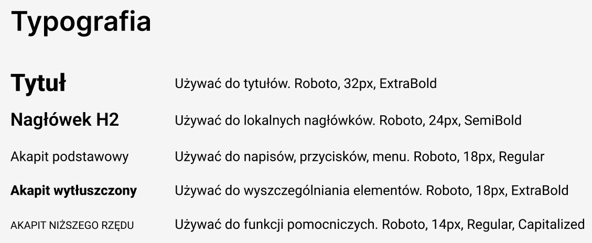
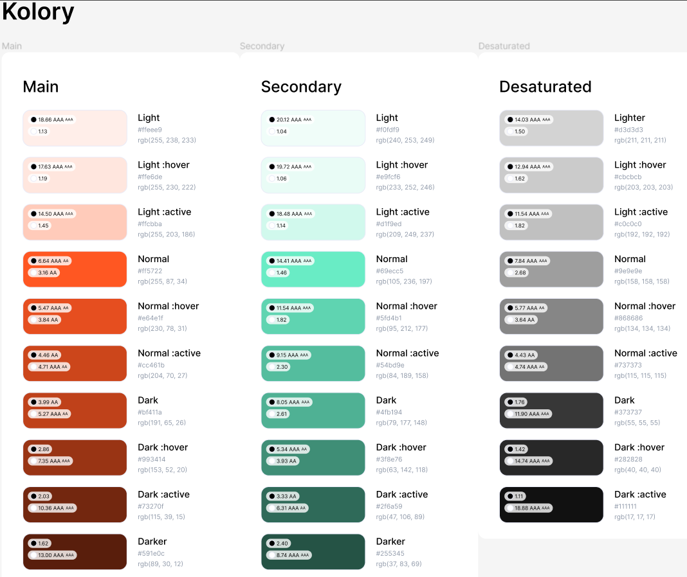

# Ustalenia dotyczące wyglądu UI

*autor: Karol Zalewski*

Po ustaleniach z klientem ustaliliśmy wstępną wizję odnoszącą się do topoligi projektu wizualnego aplikacji:
- rodzaje czcionek używanych w projekcie

- paleta kolorów używana w projekcie 

Jeśli chodzi ogólny styl i wygląd aplikacji klijent zaproponował inspirować się już istniejącymi aplikacjiami działających w podobnej branży np.: Glovo czy Wolt.
Zatem navbar może zawierać logo, wyszukiwarkę, przyciski logowania/wylogowania, profilu użytkownika, historii zamówień itp.
Na stronie głównej powinno być wyświetlane najpopularniejsze oferty, rodzaje jedzenia, rodzaje dostawców, różne kuchnie.
Na dole strony powinna zawierać się stopka zwierające regulamin, dane kontaktowe itp.
Na razie są to ustalenia wstępne i klijent pozwolił na dowolność zepołowi designerskiemu. Ewntualne uwagi będą już zwracane do konkretnych widoków.