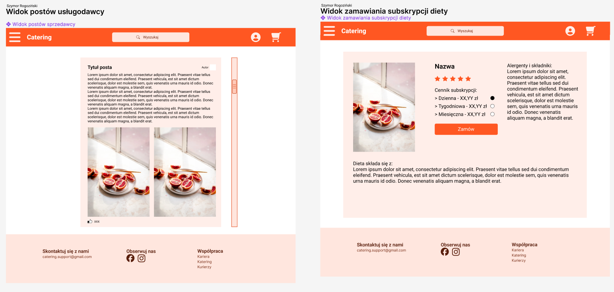

# Raport zbiorczy

## Implementacja przypadków użycia w procesach biznesowych

*autor: Tymoteusz Gryszkalis*

Po dokładnej analizie zaproponowanych opisów procesów biznesowych stwierdzam, że wszystkie przypadki użycia zostaną odpowiednio zaimplementowane.

## Raport z doprecyzowania przypadków uzycia

*autor: Mateusz Sobol*

#### Synchronizacja

**Przypadek użycia: Synchronizacja danych między stroną internetową a aplikacją mobilną**

**Aktorzy:** Użytkownik, Aplikacja mobilna, Strona internetowa

**Warunki początkowe:** Użytkownik jest zalogowany zarówno na stronie internetowej, jak i w aplikacji mobilnej.

**Opis:**
1. Użytkownik dokonuje zmiany danych na stronie internetowej lub w aplikacji mobilnej.
2. System aktualizuje dane w bazie danych.
3. System wysyła zauktualizowane dane do wszystkich zalogowanych urządzeń powiązanych z tą zmianą.

**Warunki końcowe:** Dane użytkownika są zsynchronizowane między aplikacją mobilną a stroną internetową.

#### Powiadomienia

**Przypadek użycia: Zarządzanie powiadomieniami**

**Aktorzy:** Użytkownik

**Warunki początkowe:** Użytkownik zalogowany na swoim koncie.

**Opis:**
1. Użytkownik przechodzi do ustawień powiadomień.
2. System wyświetla okno ustawięń powiadomień.
3. Użytkownik ,oże zaznaczyć preferowane rodzaje powiadomień, które chce otrzymywać.
4. Użytkownik może również wyłączyć powiadomienia, jeśli nie chce ich otrzymywać.
5. Użytkownik po dokonaniu zmian może je zapisać.
6. System aktualizuje informacje o użytkowniku.

**Warunki końcowe:** Użytkownik ma skonfigurowane powiadomienia zgodnie z własnymi preferencjami.

#### Wielojęzyczność

**Przypadek użycia: Wybór języka interfejsu**

**Aktorzy:** Użytkownik

**Warunki początkowe:** Użytkownik otwiera interfejs aplikacji.

**Opis:**
1. Użytkownik przechodzi do ustawień języka.
2. System wyświetla okno ustawień języka
3. Użytkownik wybiera preferowany język spośród dostępnych opcji: polski, angielski, ukraiński.
4. Interfejs aplikacji zmienia się na wybrany język.

**Warunki końcowe:** Interfejs aplikacji jest wyświetlany w wybranym przez użytkownika języku.

#### Posty

**Przypadek użycia: Dodawanie posta przez usługodawcę**

**Aktorzy:** Usługodawca

**Warunki początkowe:** Usługodawca jest zalogowany na swoje konto.

**Opis:**
1. Usługodawca przechodzi do opcji dodawania nowego posta na swoim profilu.
2. Wpisuje treść posta oraz dodaje zdjęcia i hasztagi.
3. Potwierdza dodanie posta. 
4. Jeżeli dodanie posta się udało system wyświetla nowy post i zapisuje ją do bazy danych. 
    1. Jeżeli dodanie posta się nie udało system wyświetla komunikat o błędzie.
5. System wysyła powiadomienia o nowym poście odpowiednim użytkownikom.

**Warunki końcowe:** Nowy post usługodawcy jest widoczny na jego profilu dla użytkowników.

#### Recenzja

**Przypadek użycia: Dodawanie recenzji przez użytkownika**

**Aktorzy:** Użytkownik

**Warunki początkowe:** Użytkownik jest zalogowany na swoje konto i posiada zakupiony produkt.

**Opis:**
1. Użytkownik przechodzi do opcji wystawiania recenzji danego produktu.
2. System wyświetla odpowiednie pole do wpisania recenzji
3. Uzytkownik wpisuje treść recenzji oraz przyznaje ocenę produktowi.
4. Użytownik potwierdza dodanie recenzji. 
    1. Jeżeli dodanie recenzji się nie udało system wyświetla komunikat o błędzie.
5. Jeżeli dodanie recenzji się udało system wyświetla nową recenzje i zapisuje ją do bazy danych.

**Warunki końcowe:** Recenzja użytkownika jest widoczna na stronie produktu dla innych użytkowników.

#### Polubienia

**Przypadek użycia: Polubienie posta przez użytkownika**

**Aktorzy:** Użytkownik

**Warunki początkowe:** Użytkownik jest zalogowany na swoje konto.

**Opis:**
1. Użytkownik przegląda posty innych użytkowników.
2. Użytkownik klikając na przycisk "polubienia", potwierdza swoje zainteresowanie postem.
3. System wyświetla odpowiednią zmianę na interfejsie.

**Warunki końcowe:** Post otrzymuje nowe polubienie od użytkownika.

#### Zbieranie statystyk

**Przypadek użycia: Zbieranie statystyk dotyczących aktywności użytkowników**

**Aktorzy:** Administrator systemu

**Warunki początkowe:** System działa i użytkownicy wykonują różne czynności.

**Opis:**
1. System monitoruje aktywność użytkowników, taką jak liczba logowań, dodanych postów, recenzji, zakupów itp. i zapisuje je do bazy danych.
2. System regularnie usuwa przestarzałe dane.
3. Zalogowany użytkownik przechodzi do okna statystyk, 
4. System wyświetla statystyki dostępne dla użytkownika.

**Warunki końcowe:** Administrator ma dostęp do statystyk dotyczących aktywności użytkowników.

#### Kredyty

**Przypadek użycia: Wykorzystanie kredytów ogólnych przez użytkownika**

**Aktorzy:** Użytkownik

**Warunki początkowe:** Użytkownik posiada kredyty ogólne na swoim koncie.

**Opis:**
  1. Użytkownik dokonuje zakupu produktu/usługi.
  2. Wybiera opcję zapłaty za pomocą kredytów.
  3. System potwierdza dokonanie płatności i odlicza odpowiednią ilość kredytów z konta użytkownika.

**Warunki końcowe:** Kredyty są dodane do konta użytkownika po zakończeniu transakcji.

#### Subskrypcje

**Przypadek użycia: Subskrypcja usługi premium przez użytkownika**

**Aktorzy:** Użytkownik

**Warunki początkowe:** Użytkownik jest zalogowany na swoje konto.

**Opis:**
1. Użytkownik przechodzi do opcji subskrypcji usługi premium.
2. Użytkownik wybiera plan subskrypcji, który najlepiej odpowiada jego potrzebom.
3. Użytkownik wybiera jedną z możliwych płatnośći: Blik, Karta
4. System wyswietla okno płatności.
5. Użytkownik realizuje płatność za pomocą wybranej metody płatności. 
    1. Jeżeli płatność się nie udała system wyświetla komunikat o błędzie 
6. Jeżeli płatność się udała system aktualizuje informacje o użytkowniku i wyświetla komunikat o sukcesie.

**Warunki końcowe:** Użytkownik uzyskuje dostęp do funkcji premium po zakończeniu transakcji.

## Raport z doprecyzowania przypadków uzycia

*autor: Szymon Kopańko*

#### Główna strona użytkownika

**Przypadek użycia: Przeglądanie głównej strony użytkownika**

**Aktorzy:** Użytkownik

**Warunki początkowe:** Użytkownik jest zalogowany na swoje konto.

**Opis:**
1. Użytkownik przechodzi do głównej strony swojego profilu.
2. System wyświetla spersonalizowany widok z informacjami o aktywnościach użytkownika, takimi jak posty, recenzje, statystyki.
3. Użytkownik może wchodzić w interakcje z elementami strony, takimi jak kliknięcie w post, przeczytanie recenzji, czy sprawdzenie statystyk.

**Warunki końcowe:** Użytkownik ma przegląd swojej aktywności i interakcji w serwisie na swojej głównej stronie profilu.

#### Wyszukiwanie

**Przypadek użycia: Wyszukiwanie produktów w aplikacji**

**Aktorzy:** Użytkownik

**Warunki początkowe:** Użytkownik jest zalogowany na swoje konto.

**Opis:**
1. Użytkownik wprowadza kryteria wyszukiwania w pole wyszukiwania.
2. System przetwarza zapytanie i wyświetla listę wyników pasujących do kryteriów wyszukiwania.
3. Użytkownik ma możliwość filtrowania i sortowania wyników wyszukiwania.

**Warunki końcowe:** Użytkownik znajduje produkty lub usługi zgodnie z wprowadzonymi kryteriami wyszukiwania.

#### Zamówienia

**Przypadek użycia: Składanie zamówienia przez użytkownika**

**Aktorzy:** Użytkownik

**Warunki początkowe:** Użytkownik jest zalogowany na swoje konto i ma wybrany produkt.

**Opis:**
1. Użytkownik dodaje wybrane produkty do koszyka.
2. Użytkownik Przechodzi do podsumowania koszyka i weryfikuje wybrane produkty.
3. Użytkownik Wybiera opcję zamówienia i wypełnia formularz z danymi do wysyłki i płatności.
    1. Jeżeli płatność się nie udała system wyświetla komunikat o błędzie.
4. Jeżeli płatność się udała, system przetwarza zamówienie i wysyła potwierdzenie na adres email użytkownika.

**Warunki końcowe:** Zamówienie jest złożone i użytkownik oczekuje na dostawę.

#### Historia

**Przypadek użycia: Przeglądanie historii zamówień**

**Aktorzy:** Użytkownik

**Warunki początkowe:** Użytkownik jest zalogowany na swoje konto.

**Opis:**
1. Użytkownik przechodzi do sekcji historii zamówień.
2. System wyświetla listę zamówień wraz z ich szczegółami: datą zamówienia, status, kwotą i opcją szczegółów.
3. Użytkownik może przeglądać szczegóły każdego zamówienia, w tym status wysyłki i historię płatności.

**Warunki końcowe:** Użytkownik ma dostęp do pełnej historii swoich zamówień.

#### Płatności

**Przypadek użycia: Realizacja płatności za zamówienie**

**Aktorzy:** Użytkownik

**Warunki początkowe:** Użytkownik ma w koszyku produkty do zakupu.

**Opis:**
1. Użytkownik przechodzi do procesu płatności.
2. Wybiera preferowaną metodę płatności spośród dostępnych opcji (karta kredytowa, przelew bankowy, płatność mobilna).
3. Wprowadza niezbędne dane do realizacji płatności.
    1. Jeżeli płatność się nie udała system wyświetla komunikat o błędzie.
4. Jeżeli płatność się udała, system potwierdza płatność i czeka na autoryzację transakcji.
5. Po pomyślnej autoryzacji, system wysyła użytkownikowi potwierdzenie transakcji i aktualizuje status zamówienia.

**Warunki końcowe:** Płatność zostaje zrealizowana, a zamówienie jest przetwarzane do wysyłki. Użytkownik otrzymuje potwierdzenie płatności.

#### Konto premium

**Przypadek użycia: Zarządzanie kontem premium przez użytkownika**

**Aktorzy:** Użytkownik

**Warunki początkowe:** Użytkownik posiada konto premium.

**Opis:**
1. Użytkownik wchodzi w ustawienia konta premium w swoim profilu.
2. Przegląda aktualny status subskrypcji, datę następnego odnowienia i dostępne plany.
3. Może wybrać opcję zmiany planu subskrypcji, przedłużenia aktualnej lub anulowania subskrypcji.
4. Po dokonaniu wyboru, użytkownik potwierdza zmiany.
5. System aktualizuje status subskrypcji i informuje użytkownika o zmianach.

**Warunki końcowe:** Użytkownik ma zaktualizowane ustawienia dotyczące konta premium zgodnie ze swoimi preferencjami.

#### Status zamówienia

**Przypadek użycia: Sprawdzanie statusu zamówienia przez użytkownika**

**Aktorzy:** Użytkownik

**Warunki początkowe:** Użytkownik posiada co najmniej jedno aktywne zamówienie.

**Opis:**
1. Użytkownik wchodzi w sekcję historii zamówień na swoim koncie.
2. Wybiera zamówienie, którego status chce sprawdzić.
3. System wyświetla szczegółowe informacje o zamówieniu, w tym aktualny status, przewidywaną datę dostawy i historię zmian statusu.
4. Użytkownik może również zobaczyć informacje o śledzeniu przesyłki, jeśli są dostępne.

**Warunki końcowe:** Użytkownik jest poinformowany o aktualnym statusie swojego zamówienia.

#### Konta

**Przypadek użycia: Zarządzanie kontami użytkowników przez administratora**

**Aktorzy:** Administrator systemu

**Warunki początkowe:** Administrator ma dostęp do panelu administracyjnego.

**Opis:**
1. Administrator loguje się do panelu administracyjnego.
2. Przegląda listę kont użytkowników, może wyszukiwać konkretnych użytkowników po nazwie, emailu lub innym kryterium.
3. Może tworzyć nowe konta, edytować istniejące profile użytkowników lub dezaktywować konta.
4. Przy edycji, może zmieniać role użytkowników, resetować hasła lub aktualizować informacje profilowe.
5. Po dokonaniu zmian, system zapisuje aktualizacje.

**Warunki końcowe:** Administrator zarządza kontami użytkowników, zapewniając prawidłowe funkcjonowanie serwisu.

#### Subskrypcja diety

**Przypadek użycia: Założenie przez użytkownika subskrypcji na dietę**

**Aktorzy:** Użytkownik

**Warunki początkowe:** Użytkownik jest zainteresowany dietą i zalogowany na swoje konto.

**Opis:**
1. Użytkownik wybiera opcję subskrypcji diety z dostępnych ofert.
2. System prezentuje formularz subskrypcji, gdzie użytkownik wybiera preferowany rodzaj diety, okres subskrypcji i szczegóły dotyczące dostawy.
3. Użytkownik przechodzi do płatności, wybierając preferowaną metodę i wprowadzając niezbędne dane.
    1. Jeżeli płatność się nie udała system wyświetla komunikat o błędzie.
4. Jeżeli płatność się udała, system przetwarza zamówienie i aktywuje subskrypcję.
5. Użytkownik otrzymuje potwierdzenie założenia subskrypcji diety oraz szczegóły dotyczące planu dostaw na podany adres.
6. System umożliwia użytkownikowi dostęp do sekcji z indywidualnym planem diety, poradami żywieniowymi i możliwością śledzenia postępów.

**Warunki końcowe:** Użytkownik posiada aktywną subskrypcję diety, z dostępem do zindywidualizowanych materiałów i wsparcia online.

## Diagramy UML

  
*autor: Karol Zalewski* 

  
*autor: Karol Zalewski*

  
*autor: Jakub Wysocki*

  
*autor: Jakub Wysocki*

  
*autor: Angelina Sudenkova*

  
*autor: Angelina Sudenkova*

  
*autor: Sebastian Pawliński*

  
*autor: Sebastian Pawliński*

  
*autor: Krzysztof Jurkowski*

  
*autor: Krzysztof Jurkowski*

  
*autor: Tymoteusz Gryszkalis*

  
*autor: Tymoteusz Gryszkalis*

  
*autor: Wojtek Szade*

  
*autor: Wojtek Szade*

## Widoki do najważniejszych PU

  
*autor: Szymon Rogodziński*

  
*autor: Filip Sosnowski*

  
*autor: Filip Sosnowski*

  
*autor: Filip Sosnowski*

## Reporty z opisów testowania przypadków użycia

*autor: Mateusz Czarnecki*

### **1. Synchronizacja**

**Opis testu:** Weryfikacja automatycznej synchronizacji danych między stroną internetową a aplikacją mobilną po dokonaniu zmian w jednej z platform.

- **Kroki:**
    1. Zaloguj się na stronie internetowej i w aplikacji mobilnej.
    2. Dokonaj zmiany danych na stronie internetowej.
    3. Sprawdź, czy dane zostały zaktualizowane w aplikacji mobilnej.
    4. Dokonaj zmiany danych w aplikacji mobilnej.
    5. Sprawdź, czy dane zostały zaktualizowane na stronie internetowej.
- **Miara testu:**
    - **Pozytywny wynik:** Dane są automatycznie i bezbłędnie synchronizowane między obiema platformami niezależnie od miejsca wprowadzenia zmian.
    - **Negatywny wynik:** Dane nie są synchronizowane lub są synchronizowane z opóźnieniem/ błędami.
    

### **2. Powiadomienia**

**Opis testu:** Sprawdzenie możliwości konfiguracji preferencji powiadomień przez użytkownika.

- **Kroki:**
    1. Zaloguj się na konto użytkownika.
    2. Przejdź do ustawień powiadomień.
    3. Zaznacz preferowane typy powiadomień i zapisz ustawienia.
    4. Wyłącz wszystkie powiadomienia i zapisz ustawienia.
    5. Sprawdź, czy system przestrzega zapisanych preferencji.
- **Miara testu:**
    - **Pozytywny wynik:** Użytkownik otrzymuje tylko wybrane powiadomienia lub żadne, jeśli wszystkie zostały wyłączone.
    - **Negatywny wynik:** Użytkownik otrzymuje niepożądane powiadomienia lub nie otrzymuje wybranych powiadomień.

### **3. Wielojęzyczność**

**Opis testu:** Weryfikacja zmiany języka interfejsu aplikacji na wybrany przez użytkownika.

- **Kroki:**
    1. Otwórz aplikację i przejdź do ustawień języka.
    2. Wybierz każdy z dostępnych języków i zaakceptuj zmianę.
    3. Sprawdź, czy cały interfejs aplikacji zmienia się na wybrany język.
- **Miara testu:**
    - **Pozytywny wynik:** Interfejs aplikacji poprawnie wyświetla się w każdym z wybranych języków.
    - **Negatywny wynik:** Części interfejsu nie zmieniają języka lub pojawiają się błędy w wyświetlaniu.

### **4. Posty**

**Opis testu:** Testowanie dodawania nowego posta przez usługodawcę.

- **Kroki:**
    1. Zaloguj się jako usługodawca.
    2. Dodaj nowy post, wprowadzając tekst, zdjęcia i hasztagi.
    3. Sprawdź, czy post jest widoczny na profilu usługodawcy.
- **Miara testu:**
    - **Pozytywny wynik:** Post jest poprawnie dodany i widoczny dla użytkowników.
    - **Negatywny wynik:** Post nie jest widoczny lub pojawiają się błędy podczas dodawania.

### **5. Recenzja**

**Opis testu:** Sprawdzenie procesu dodawania recenzji i oceny produktu/usługodawcy przez użytkownika.

- **Kroki:**
    1. Zaloguj się jako użytkownik, który posiada zakupiony produkt.
    2. Przejdź do opcji wystawienia recenzji dla zakupionego produktu/usługodawcy.
    3. Wpisz tekst recenzji oraz ocenę produktu/usługodawcy w skali 5 gwiazdek.
    4. Potwierdź dodanie recenzji.
    5. Sprawdź, czy recenzja jest widoczna na profilu produktu/usługodawcy.
- **Miara testu:**
    - **Pozytywny wynik:** Post jest poprawnie oznaczony jako polubiony przez użytkownika, a liczba polubień posta zwiększa się o 1.
    - **Negatywny wynik:** Polubienie nie jest rejestrowane, post nie jest oznaczony jako polubiony lub liczba polubień się nie zmienia.

### **6. Polubienia**

**Opis testu:** Weryfikacja funkcjonalności polubienia posta przez użytkownika.

- **Kroki:**
    1. Zaloguj się jako użytkownik.
    2. Przeglądaj posty na platformie.
    3. Kliknij przycisk "polubienia" pod wybranym postem.
    4. Sprawdź, czy system zarejestrował polubienie i czy post jest oznaczony jako polubiony.
- **Miara testu:**
    - **Pozytywny wynik:** Post jest poprawnie oznaczony jako polubiony przez użytkownika, a liczba polubień posta zwiększa się o 1.
    - **Negatywny wynik:** Polubienie nie jest rejestrowane, post nie jest oznaczony jako polubiony lub liczba polubień się nie zmienia.

*autor: Igor Kędzierewski*

### **7. Zbieranie statystyk**
**Opis testu:** Weryfikacja poprawności zbierania danych dotyczących aktywności użytkowników przez system.

- **Kroki:**
  1. Sprawdź, czy system monitoruje aktywność użytkowników poprzez zapisywanie odpowiednich zdarzeń.
  2. Wykonaj różne czynności jako użytkownicy, takie jak logowanie, dodawanie postów, wystawianie recenzji, dokonywanie zakupów.
  3. Po upływie określonego czasu, sprawdź, czy system prawidłowo zbiera dane dotyczące tych aktywności.
  4. Zweryfikuj, czy zebrane dane są przechowywane w systemie.
  5. Upewnij się, że administrator ma dostęp do zebranych statystyk dotyczących aktywności użytkowników.

- **Miara testu:**
  - **Pozytywny wynik:** System poprawnie monitoruje aktywność użytkowników i zbiera dane, a administrator może uzyskać dostęp do zebranych statystyk.
  - **Negatywny wynik:** System nie rejestruje wszystkich aktywności użytkowników lub dane nie są poprawnie zbierane i przechowywane, co uniemożliwia administratorowi uzyskanie dostępu do statystyk.

### **8. Kredyty**
**Opis testu:** Weryfikacja wykorzystanie kredytów ogólnych przez użytkownika.

- **Kroki:**
  1. Użytkownik loguje się na swoje konto.
  2. Użytkownik przechodzi do dowolnej ofrty w aplikacji.
  3. Użytkownik wybiera formę płatności jako kredyty ogólne lub specjalnie nadane do danego usługodawcy.
  4. Użytkownik realizuje płatność.

- **Miara testu:**
  - **Pozytywny wynik:** Po zakończeniu transakcji kredyty są usuwane z konta użytkownika, ofrta trafia do realizacji.
  - **Negatywny wynik:** Transakcja nie zostaje zrealizowana lub kredyty nie są poprawnie usuwane z konta użytkownika.

### **9. Subskrypcje**
**Opis testu:** Weryfikacja procesu subskrypcji usługi premium przez użytkownika.

- **Kroki:**
  1. Użytkownik przechodzi do opcji subskrypcji usługi premium.
  2. Wybiera plan subskrypcji, który najlepiej odpowiada jego potrzebom.ji, dokonywanie zakupów.
  3. Realizuje płatność za pomocą wybranej metody płatności.

- **Miara testu:**
  - **Pozytywny wynik:** Użytkownik uzyskuje dostęp do funkcji premium po zakończeniu transakcji.
  - **Negatywny wynik:** Użytkownik nie uzyskuje dostępu do funkcji premium po zakończeniu transakcji lub proces subskrypcji kończy się błędem.

### **10. Główna strona użytkownika**
**Opis testu:** Weryfikacja funkcji wyświetlania rekomendacji dla użytkownika.

- **Kroki:**
  1. Zaloguj się na swoje konto użytkownika.
  2. Sprawdź, czy są wyświetlane posty, proponowae dania pokrywają się z subskrybowanymi usługodawcami czy ostatnio dokonywanami zakupami.

- **Miara testu:**
  - **Pozytywny wynik:** System prawidłowo proponuje uzytkownikowi treści w zależności od jego ostatnicj aktywności.
  - **Negatywny wynik:** Brak wyświetlanych informacji lub propozycje nie są skorelowane z ostatnimi aktywnosciami użytkownika.

### **11. Wyszukiwanie**
**Opis testu:** Weryfikacja funkcjonalności wyszukiwania produktów w aplikacji.

- **Kroki:**
  1. Użytkownik zalogowuje się na swoje konto.
  2. Użytkownik wprowadza kryteria wyszukiwania w pole wyszukiwania.
  3. Użytkownik naciska przycisk lub klawisz "Szukaj".
  4. System przetwarza zapytanie i wyświetla wyniki pasujące do podanych kryteriów.

- **Miara testu:**
  - **Pozytywny wynik:** System wyświetla poprawne wyniki wyszukiwania zgodne z podanymi kryteriami.
  - **Negatywny wynik:** System nie wyświetla żadnych wyników, wyświetla błędne wyniki lub aplikacja zawiesza się podczas wyszukiwania.

### **12. Zamówienia**
**Opis testu:** Weryfikacja procesu składania zamówienia przez użytkownika.

- **Kroki:**
  1. Użytkownik zalogowuje się na swoje konto i znajduje się na stronie produktu.
  2. Użytkownik wybiera produkt, który chce zamówić.
  3. Użytkownik dodaje produkt do koszyka lub przechodzi od razu do procesu zamawiania.
  4. Użytkownik podaje niezbędne dane do zrealizowania zamówienia, takie jak adres dostawy, metoda płatności itp.
  5. Użytkownik potwierdza zamówienie.
- **Miara testu:**
  - **Pozytywny wynik:** Zamówienie jest pomyślnie złożone i widoczne w historii zamówień użytkownika.
  - **Negatywny wynik:** Nie można dokończyć procesu zamówienia z powodu błędów, zamówienie nie jest widoczne w historii zamówień użytkownika lub występują problemy z płatnością.

*autor: Szymon Ochnio*

### **13. Historia**
**Opis testu:** Test przeglądania historii zamówień przez użytkownika.

- **Kroki:**
  1. Użytkownik loguje się na swoje konto na platformie sklepu.
  2. Użytkownik przechodzi do ustawień konta.
  3. Użytkownik wybiera opcję "historia zamówień".
  4. Użytkownik przegląda listę wcześniej złożonych zamówień.
  5. Użytkownik wybiera dowolne zamówienie.
  6. Użytkownik sprawdza szczegóły zamówienia, w tym status dostawy.
- **Miara testu:**
  - **Pozytywny wynik:** Lista złożonych zamówień jest widoczna. Szczegóły każdego zamówienia, w tym status dostawy, są dostępne po wybraniu odpowiedniej pozycji na liście.
  - **Negatywny wynik:** Historia zamówień jest niewidoczna, niekompletna lub szczegółowe informacje o poszczególnych zamówieniach nie są dostępne.

### **14. Płatności**
**Opis testu:** Test realizacji płatności za zamówienie przez użytkownika

- **Kroki:**
  1. Użytkownik loguje się na swoje konto.
  2. Przechodzi do koszyka z wybranymi produktami.
  3. Wybiera opcję realizacji płatności.
  4. Wybiera metodę płatności i wprowadza niezbędne dane.
  5. Potwierdza płatność przez kliknięcie przycisku "Zapłać".
- **Miara testu:**
  - **Pozytywny wynik:** Płatność zostaje zrealizowana, a użytkownik otrzymuje potwierdzenie transakcji.
  - **Negatywny wynik:** Płatność nie zostaje zrealizowana, użytkownik nie otrzymuje potwierdzenia transakcji.

### **15. Konto premium**
**Opis testu:** Test zakupu kontem premium przez użytkownika

- **Kroki:**
  1. Użytkownik loguje się na swoje konto.
  2. Przechodzi do ustawień konta.
  3. Wybiera opcję zakupu konta premium.
  4. Dokonuje tranzakcji.
  5. Użytkownik ma dostęp do nowych funkcjonalności.
- **Miara testu:**
  - **Pozytywny wynik:** Użytkownik widzi zmiany w strukturze aplikacji i posiada dostęp do wcześniej nie dostępnych funkcjonalności.
  - **Negatywny wynik:** Użytkownik nie ma dostępu do funkcjonalności premium lub tranzakcja nie zostaje wykonana.

### **16. Status zamówienia**
**Opis testu:** Test sprawdzania statusu zamówienia przez użytkownika

- **Kroki:**
  1. Użytkownik loguje się do systemu.
  2. Użytkownik przechodzi do historii swoich zamówień.
  3. Użytkownik wybiera zamówienie, którego status chce sprawdzić.
  4. Użytkownik sprawdza status wybranego zamówienia.
- **Miara testu:**
  - **Pozytywny wynik:** Informacja o statusie zamówienia jest zgodna z aktualnym stanem i jest dla użytkownika zrozumiała.
  - **Negatywny wynik:** Informacja o statusie zamówienia jest niezgodna z aktualnym stanem lub nie jest dla użytkownika zrozumiała.

### **17. Zarządzanie kontami użytkowników przez administratora**
**Opis testu:** Test zarządzania kontami użytkowników przez administratora

- **Kroki:**
  1. Administrator loguje się do panelu administracyjnego.
  2. Administrator przechodzi do sekcji zarządzania kontami użytkowników.
  3. Administrator przegląda listę wszystkich kont użytkowników.
  4. Administrator dodaje, edytuje lub usuwa wybrane konta.
- **Miara testu:**
  - **Pozytywny wynik:** Administracja kontami użytkowników przebiega zgodnie z oczekiwaniami, wszystkie zmiany są poprawnie zapisywane w systemie.
  - **Negatywny wynik:** Administracja kontami użytkowników napotyka na problemy, zmiany nie są zapisywane lub są zapisywane niepoprawnie.

### **18. Subskrypcja diety**
**Opis testu:** Test złożenie przez użytkownika subksrypcji na dietę

- **Kroki:**
  1. Użytkownik loguje się do systemu.
  2. Użytkownik przechodzi do zakupu diety.
  3. Użytkownik wybiera okres na jaki chce zakupić deitę.
  4. Użytkownik wybiera formę płatności i jej dokonuje
  5. Użytkownik dostaje komunikat o dokonaniu subksrypcji i jest ją w stanie zobaczyć w liście swoich subksrypcji
- **Miara testu:**
  - **Pozytywny wynik:** Użtkownik widzi informacje o dokonanej subskrypcji a odpowiedni usługodawcy również dostali powaidamenie o jej dokonaniu.
  - **Negatywny wynik:** Użytkownik nie jest w stanie sprawdzić swoich subskrypcji lub informacja o subskrypcji nie doszła do usługodawców.