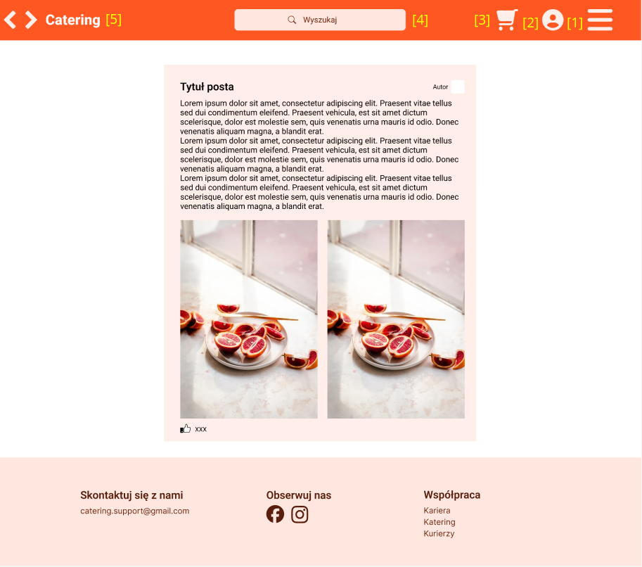

# Dokumentacja logiki nawigacji aplikacji

_autor: Igor Kędzierawski_

## Strona logowania:

-   **Widok:** Formularz logowania.
-   **Przejścia:** Możliwość przejścia do strony rejestracji użytkownika lub dostawcy [1].
-   **Błędy:** Błąd logowania przy nieprawidłowych danych, komunikat o nieudanej rejestracji użytkownika.
-   **Kluczowe elementy:** Pole do wprowadzenia nazwy użytkownika i hasła, opcja zapomnianego hasła.

## Strona rejestracji użytkownika:

-   **Widok:** Formularz rejestracji dla użytkowników.
-   **Przejścia:** Możliwość przejścia do strony logowania [1].
-   **Błędy:** Komunikat o błędnie wypełnionych polach, informacja o niepowodzeniu rejestracji.
-   **Kluczowe elementy:** Pola do wprowadzenia danych osobowych, opcja wyboru typu konta.

## Strona rejestracji dostawcy:

-   **Widok:** Formularz rejestracji dla dostawców.
-   **Przejścia:** Możliwość przejścia do strony logowania [1].
-   **Błędy:** Komunikat o błędnie wypełnionych polach, informacja o niepowodzeniu rejestracji.
-   **Kluczowe elementy:** Pola do wprowadzenia danych firmy, opcja wyboru typu konta.

## Panel powitalny (dla użytkownika i dostawcy):

-   **Widok:** Personalizowany panel powitalny po zalogowaniu.
-   **Przejścia:** Możliwość przejścia do strony logowania i strony rejestracji [1].
-   **Kluczowe elementy:** Powitanie użytkownika lub dostawcy, menu nawigacyjne.

## Główny widok usługodawcy:

-   **Widok:** Panel zarządzania usługami lub produktami.
-   **Przejścia:** Możliwość przejścia do widoku zamówień, ofert, opini, postów, statystyk i ustawień [1-6]. Możliwość zobaczenia koszyka, konta i rozwinięcia sidebara [7,9,10]. Możliwość użycia opcji szukaj [8]. Możliwośc przejścia do strony głównej [11]
-   **Kluczowe elementy:** Lista usług lub produktów, opcje edycji i dodawania.

## Widok postów sprzedawcy/usługodawcy:

-   **Widok:** Lista postów sprzedawcy/usługodawcy.
-   **Przejścia:** Możliwość zobaczenia koszyka, konta i rozwinięcia sidebara [1,2,3]. Możliwość użycia opcji szukaj [4]. Możliwośc przejścia do strony głównej [5]
-   **Kluczowe elementy:** Lista postów.

## Widok płatności (subskrypcja):

-   **Widok:** Formularz płatności dla subskrypcji.
-   **Przejścia:**  Możliwości z topbara. Możliwość przejścia na stronę zapłaty [4]
-   **Kluczowe elementy:** Możliwość zatwierdzenia płatności [1]. Możliwość wyboru sposobu płatności [2]. Możliwość szybkiego poglądu koszyka [3].

## Widok płatności (plan Premium):

-   **Widok:** Formularz płatności dla planu Premium.
-   **Przejścia:** Możliwość wyboru sposobu płatności [1]. Możliwość zatwierdzenia płatności [2].
-   **Kluczowe elementy:** Formularz sposobu płatności.

## Widok płatności (danie):

-   **Widok:** Formularz płatności za danie.
-   **Przejścia:** Możliwości z topbara. Możliwość przejścia na stronę zapłaty [4]
-   **Kluczowe elementy:** Możliwość wprowadzenia danych dostawy [1]. Komunikat o darmowej dostawie (Premium) [2]. Wybór sposobu płatności [3]. Zatwierdzenie zamówienia [4]. Możliwość szybkiego poglądu koszyka [5]. Komuniakat o zaoszędzonej kwocie za dostawe (Premium) [6]. Łączna kwota [7]

## Widok płatności - błąd (plan Premium):

-   **Widok:** Komunikat o błędzie płatności dla planu Premium.
-   **Przejścia:** Możliwości z topbara. Możliwość przejścia do widoku płatności[1].
-   **Kluczowe elementy:** Komunikat o błędzie, opcja powrotu.

## Widok popupów z błędami:

-   **Widok:** Wyświetlenie popupów z komunikatami błędów.
-   **Przejścia:** Brak, po zamknięciu [1,2] popupa pozostanie na aktualnej stronie.
-   **Kluczowe elementy:** Przyciski do zamykania popupa [1,2]. Tytuł błędu [4]. Treść błędu [3]

## Widok podglądu koszyka:

-   **Widok:** Podgląd zawartości koszyka przed dokonaniem zakupu.
-   **Przejścia:** Możliwości z topbara. Możliwość przejścia do widoków zapłaty [3]
-   **Kluczowe elementy:** Lista produktów w koszyku [1]. Wartość koszyka [2]. Przycisk przejścia do kasy [3]

## Strona zamówienia:

-   **Widok:** Podląd zamówień, ich statusu, subskrybcji i historii.
-   **Przejścia:** Możliwości z topbara. Możliwości stronicowania zamówień [4]. Możliwość przejścia do opcji subskrybcji [3].
-   **Kluczowe elementy:** Komponent z statusem zamówienia [1]. Komponent z aktywnymi subskrybcjami [2]. Komponent z listą zamówień [4]. Przycisk opcji subskrybcji [3]. Przyciski zarządzania zamówieniami [6]. Przycisk anulowania zamówienia [5]. Przyciski do stronicowania zamówień [7]

## Widok dodawania recenzji:

-   **Widok:** Formularz dodawania recenzji.
-   **Przejścia:** Przejście do poprzedniej strony [5]. Przejście do opublikowanej opini [6].
-   **Kluczowe elementy:** Nazwa dania [1]. Ocena zbiorcza [2] i oceny cząstkowe [3]. Pole do wpisania opini [4]. Przycisk anulowania zostawiania opini [5]. Przycisk publikujący opinię [6] 

## Widok dodawania postów przez usługodawcę:

-   **Widok:** Formularz dodawania postów.
-   **Przejścia:** Możliwości z topbara. Możliwość przejścia do strony z dodanym postem [3]
-   **Kluczowe elementy:** Pole do załączania plików [1]. Pole do wpisywania treści posta [2]. Przycisk do publickacji posta [3].

