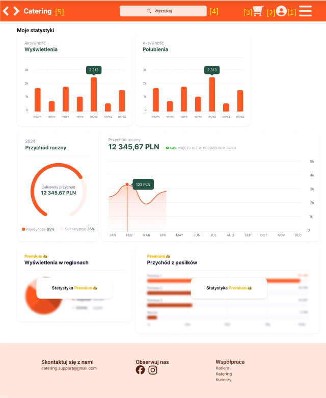
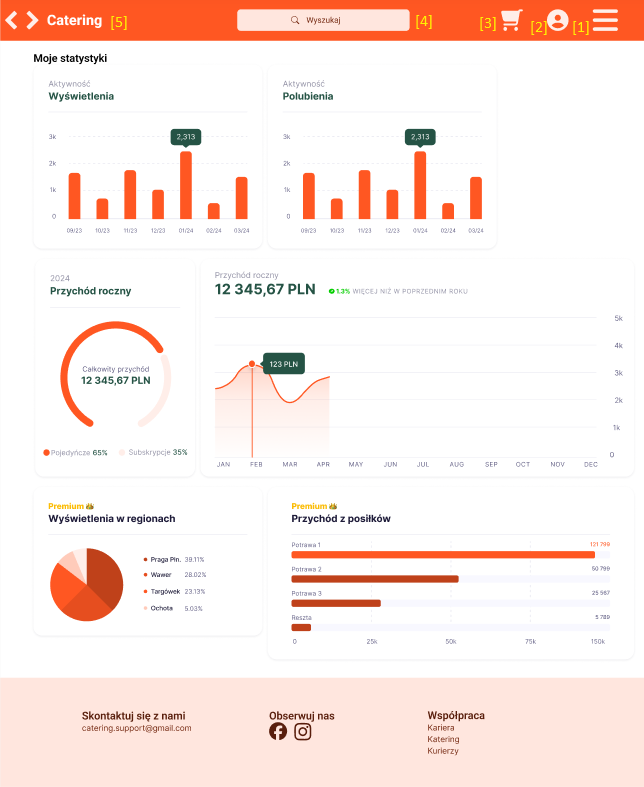
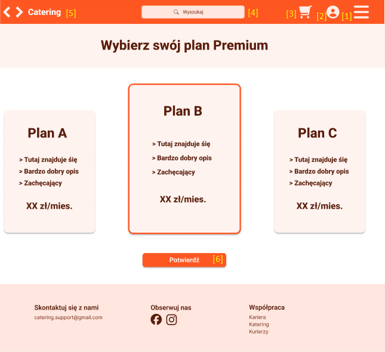
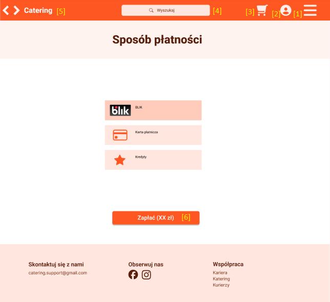
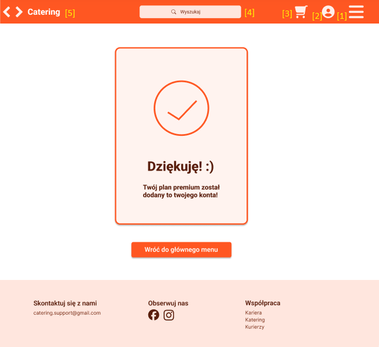
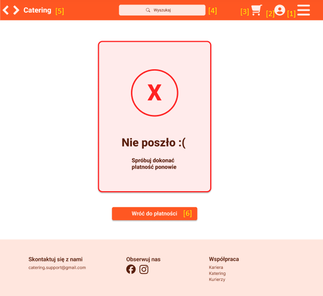
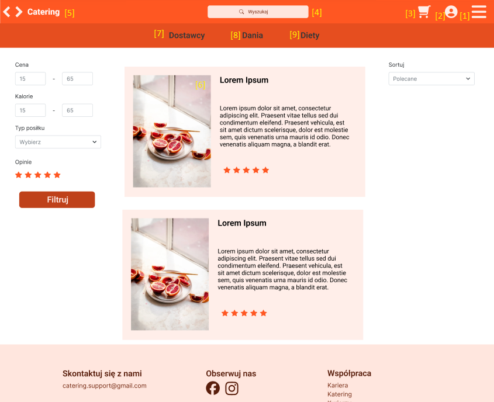

# Dokumentacja logiki nawigacji aplikacji

_autor: Tymoteusz Gryszkalis_

## Statystyki podstawowe:

- **Widok:** Okno statystyk podstawowych.
- **Przejścia:** Możliwość zobaczenia koszyka, konta i rozwinięcia sidebara [1,2,3]. Możliwość użycia opcji szukaj [4]. Możliwość przejścia do
  strony głównej [5].
- **Kluczowe elementy:** Lista statystyk podstawowych

## Statystyki premium:

- **Widok:** Okno statystyk premium.
- **Przejścia:** Możliwość zobaczenia koszyka, konta i rozwinięcia sidebara [1,2,3]. Możliwość użycia opcji szukaj [4]. Możliwość przejścia do
  strony głównej [5].
- **Kluczowe elementy:** Lista wszystkich statystyk.

## Zakup konta premium:

- **Widok:** Zakup konta premium.
- **Przejścia:** Możliwość zobaczenia koszyka, konta i rozwinięcia sidebara [1,2,3]. Możliwość użycia opcji szukaj [4]. Możliwość przejścia do
  strony głównej [5]. Możliwość przejścia do strony płatności [6].
- **Kluczowe elementy:** Plany premium do wyboru.

## Płatność za konto premium:

- **Widok:** Widok płatności (plan Premium).
- **Przejścia:** Możliwość zobaczenia koszyka, konta i rozwinięcia sidebara [1,2,3]. Możliwość użycia opcji szukaj [4]. Możliwość przejścia do
  strony głównej [5]. Możliwość zapłaty [6].
- **Kluczowe elementy:** Metody płatności do wyboru.

## Udana płatność za konto premium:

- **Widok:** Widok płatności - OK (plan Premium).
- **Przejścia:** Możliwość zobaczenia koszyka, konta i rozwinięcia sidebara [1,2,3]. Możliwość użycia opcji szukaj [4]. Możliwość przejścia do
  strony głównej [5,6].
- **Kluczowe elementy:** Informacja o powodzeniu płatności.

## Nieudana płatność za konto premium:

- **Widok:** Widok płatności - błąd (plan Premium).
- **Przejścia:** Możliwość zobaczenia koszyka, konta i rozwinięcia sidebara [1,2,3]. Możliwość użycia opcji szukaj [4]. Możliwość przejścia do
  strony głównej [5]. Możliwość przejścia do strony płatności [6].
- **Kluczowe elementy:** Informacja o niepowodzeniu płatności.

## Wyszukiwanie:

- **Widok:** Panel wyszukiwania 2.
- **Przejścia:** Możliwość zobaczenia koszyka, konta i rozwinięcia sidebara [1,2,3]. Możliwość użycia opcji szukaj [4]. Możliwość przejścia do
  strony głównej [5]. Możliwość przejścia do wybranej pozycji wyszukiwania [6]. Możliwość wyszukania daniej kategorii [7,8,9]
- **Kluczowe elementy:** Wyniki wyszukiwania, kategorie wyszukiwania, narzędzie filtrujące, narzędzie sortujące.

## Dodawania kredytów

- **Widok:** Okno dodawania kredytów użytkownikowi.
- **Przejścia:** Możliwość dokonania operacji dodania kredytów [1]. Możliwość przejścia do strony głównej [2].
- **Kluczowe elementy:** Formularz do sformalizowania dodania kredytów.

## Jakiegoś przejścia do trybu ciemnego

- **Widok:** Przykładowe okno trybu ciemnego.
- **Przejścia:** Aby zmienić tryb jasności aplikacji należy wejść w rozwijane menu boczne [1], a następnie wybrać opcję trybu ciemnego [2].
- **Kluczowe elementy:** Odpowiadające odpowiedniemu widokowi.

  

